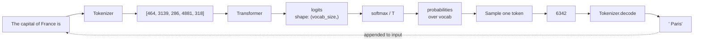

# Post 1 — What an LLM Actually Is: Tokens In, Tokens Out

*Part 1 of 12 in **LLM From Scratch**, a series that builds a Gemini/Claude-style decoder in Google Colab, one component at a time.*

## How to read this post

- **Skim mode (2 min):** read the headers, the one diagram, and the "How frontier LLMs do this" callout at the end.
- **Read mode (10 min):** read everything.
- **Run mode (20 min):** open the Colab and run every cell. This is where the intuition actually clicks.

> Colab: **[Open in Colab — `post_01_tokens_in_tokens_out.ipynb`](https://colab.research.google.com/github/<your-handle>/llm-from-scratch-series/blob/main/posts/01-tokens-in-tokens-out/notebook.ipynb)** — runs on a free CPU runtime in under 5 minutes.

---

## 1. The whole job of an LLM, in one sentence

> **Given some text, predict the next token. Then append that token and predict again. Loop.**

That is — almost unbelievably — the *entire* job description of GPT-4, Claude 4, Gemini 3, and the small model we are going to build in this series. Everything else (attention, RoPE, MoE, RLHF) is engineering to make that one job *cheaper, faster, and more accurate*.

Let me make it concrete. You type:

```
The capital of France is
```

The model emits, one token at a time:

```
 Paris . It is famous for the Eiffel Tower .
```

Each of those tokens was produced by the same operation: feed everything seen so far into the model, get a probability distribution over the entire vocabulary, pick one, append, repeat. That loop is called **autoregressive decoding**, and it is the loop you will write in this post.

## 2. Tokens, not words

Models don't see characters or words — they see *tokens*, which are sub-word chunks. The string `" Paris"` (note the leading space) is usually a single token in modern tokenizers; `" antidisestablishmentarianism"` might be 4–6 tokens.

We'll go deep on tokenization in **Post 2**. For today, treat the tokenizer as a black box with two methods: `encode(text) -> [int, int, ...]` and `decode([int, int, ...]) -> text`.

## 3. The shape of "predicting the next token"

Inside the model, every token is mapped to a vector. The model crunches those vectors and, for the *last* position only (when generating), produces a vector of size `vocab_size` — call it `logits`. There is one logit per token in the vocabulary (~50,000 for GPT-2, ~128,000+ for Llama 3 / Claude / Gemini).

Turning logits into probabilities is one line of math — the **softmax**:

$$
p_i = \frac{e^{l_i / T}}{\sum_j e^{l_j / T}}
$$

`T` is the **temperature**. `T = 1` is "as the model thinks." `T < 1` makes the distribution sharper (greedier, more boring). `T > 1` flattens it (more creative, more risk of nonsense). `T = 0` collapses to greedy: always pick the top token.



That diagram is the whole show. The rest of this series is *what's inside the Transformer box*.

## 4. Cross-entropy loss, in plain English

During training, the model is shown lots of real text and asked: "given everything up to position `t-1`, what's your distribution over token `t`?" If the true token was `Paris` and the model assigned it probability 0.4, that's pretty good. If it assigned 0.001, that's terrible.

**Cross-entropy loss** quantifies how surprised the model was, averaged across all positions:

$$
\mathcal{L} = -\frac{1}{N} \sum_{t} \log p_\theta(\text{true token}_t \mid \text{context}_{<t})
$$

Lower is better. A perfectly confident, correct model has loss 0. A model that uniformly guesses across a vocab of 50,000 has loss ≈ `ln(50000) ≈ 10.8`. Real pretrained LLMs land around 2–3 on natural language. That's it. That is the only number being optimized during pretraining of every frontier model on Earth.

## 5. The decoding loop you'll write today

In the Colab you will:

1. Load **GPT-2** from Hugging Face (124M params — small enough to run on CPU).
2. Tokenize a prompt.
3. Run one forward pass to get logits.
4. Softmax → probabilities → sample.
5. Wrap that in a `for` loop to generate N tokens.
6. **Visualize the top-10 candidates at each step** with a bar chart.
7. Show how `temperature` and `top-k` change the output.

You'll watch the model literally think — at each step you'll see "the model considered ` Paris` (0.41), ` London` (0.07), ` the` (0.04)…" and picked one.

## 6. How frontier LLMs do this

This is the **"How frontier LLMs do this"** sidebar that will appear in every post.

- **Gemini 3, Claude 4, GPT-4o** are all autoregressive decoders. They run the exact loop you'll run today.
- They are *vastly* bigger (hundreds of billions of parameters, vocabularies of 100k–256k).
- They use cleverer sampling (top-p, min-p, sometimes speculative decoding — see **Post 9**) and serve many users at once with **KV caches** (also Post 9).
- Multimodal models (Gemini's image input, Claude's vision) prepend image/audio tokens to the same sequence — the *decoding loop is unchanged*.

The loop is the lingua franca of modern AI. Once you've written it, you've written the outermost layer of every chatbot in production.

## 7. What we'll do next post

**Post 2 — Tokenization & BPE.** We treated the tokenizer as a black box today. Next post we open the box: train a Byte-Pair Encoding tokenizer from scratch in ~80 lines of Python, then a production-grade one on TinyStories, and answer "why does my OpenAI bill scale with tokens, not characters?"

---

*Code for this series lives at [github.com/<your-handle>/llm-from-scratch-series](https://github.com/<your-handle>/llm-from-scratch-series). Pinned commit for this post: `v0.1.0`.*
