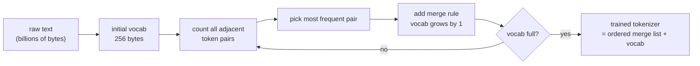

# Post 2 — Tokenization: How Text Becomes Numbers (BPE From Scratch)

*Part 2 of 12 in **LLM From Scratch**, a series that builds a Gemini/Claude-style decoder in Google Colab, one component at a time.*

In **Post 1** we treated the tokenizer as a black box: `text → [int, int, ...] → text`. Today we open the box. We will implement **Byte-Pair Encoding (BPE)** — the algorithm behind GPT-2, GPT-4, Llama 3, and (essentially) Claude and Gemini — in ~80 lines of pure Python. Then we train a production-grade tokenizer on **TinyStories**, and end by measuring why your OpenAI bill is so much higher when your users speak Hindi or paste code.

## How to read this post

- **Skim (2 min):** the diagram + the "tokens-per-word" table at the end.
- **Read (12 min):** all of it.
- **Run (25 min):** open the Colab, train your own tokenizer, watch merges happen live.

> Colab: **[Open in Colab — `notebook.ipynb`](https://colab.research.google.com/github/lingareddyk-proc/llm-from-scratch-series/blob/main/posts/02-tokenization-bpe/notebook.ipynb)** — runs on free CPU in ~10 minutes.

---

## 1. Why not just use characters? Or words?

Two extremes, both bad:

**Characters.** A 256-symbol vocab (one per byte) is tiny — but every English word becomes 4–10 tokens. Sequences blow up, training is slow, and the model wastes capacity learning that `t-h-e` means "the."

**Words.** A vocab of "every word in the corpus" is huge (millions for a multilingual corpus) and **brittle**: any word the tokenizer hasn't seen before becomes `<unk>` and the model is blind to it. Misspellings, code identifiers, new product names — all `<unk>`.

We want the middle: common chunks stay one token (` the`, ` and`, `tion`), rare or novel strings degrade gracefully into sub-pieces. That's exactly what **BPE** gives us.

## 2. BPE in plain English

> **Start with every character (or byte) as its own token. Repeatedly find the most frequent adjacent pair and merge it into a new token. Stop when you hit your target vocab size.**

That's the entire algorithm. Toy example — corpus: `"low low lower newer wider"`.

Initial tokens (one per char, `_` for word boundary):

```
_ l o w   _ l o w   _ l o w e r   _ n e w e r   _ w i d e r
```

Most common adjacent pair: `(l, o)` (3×). Merge → new token `lo`.

```
_ lo w   _ lo w   _ lo w e r   _ n e w e r   _ w i d e r
```

Next: `(lo, w)` (3×). Merge → `low`.

```
_ low   _ low   _ low e r   _ n e w e r   _ w i d e r
```

Next: `(e, r)` (3×). Merge → `er`.

After a handful of merges, frequent words become one token, rare combinations stay split. The list of merges (`l + o → lo`, `lo + w → low`, `e + r → er`, …) **is the tokenizer**.

At inference, you re-apply the merges in the same order to any new text — including text the tokenizer has never seen — and you always get a valid token sequence. There is no `<unk>`.



## 3. Byte-level BPE, the trick GPT-2 introduced

What about emoji, Chinese characters, arbitrary binary? GPT-2's insight: **work on bytes, not Unicode characters.** Every possible text on Earth, in any script, is a sequence of bytes (UTF-8). 256 starting symbols. No `<unk>`, ever. This is what Llama, GPT-4, and most modern open models do. Gemini and Claude use proprietary tokenizers but the same family.

## 4. Vocab size: a trade-off, not a free lunch

Bigger vocab → fewer tokens per document → cheaper inference, longer effective context.
Bigger vocab → larger embedding matrix → more parameters, more memory, slower softmax over `vocab_size` at the output layer.

Typical sizes today:

| Model           | Vocab size |
| --------------- | ----------:|
| GPT-2           | 50,257     |
| GPT-3 / GPT-3.5 | 50,257     |
| GPT-4 / GPT-4o  | ~100,277   |
| Llama 3         | 128,256    |
| Gemini (public estimates) | ~256,000 |
| Claude  (estimates) | ~65k–100k |

Bigger vocabs help especially with **non-English** text — see section 7.

## 5. What you'll build in the Colab

1. **BPE from scratch in ~80 lines.** Train on a 5-sentence toy corpus and watch every merge happen step by step.
2. **A production-grade tokenizer** with the Hugging Face `tokenizers` library, trained on **TinyStories** (the corpus we'll use for pretraining in Post 8).
3. **Encode and decode** real sentences with your tokenizer; verify roundtripping.
4. **Compare your tokenizer to GPT-2, GPT-4 (`tiktoken`), and Llama 3** on the same text.
5. **Measure tokens-per-word across languages and content types** (English prose, Python code, Hindi, emoji) — the result will explain a lot about how LLM pricing works.

## 6. How frontier LLMs do this

- **Algorithm family:** GPT-4, Llama 3, Mistral, Gemma all use BPE (some Unigram, e.g. older SentencePiece-based models). Claude and Gemini are believed to use BPE/SentencePiece variants — exact training data and vocab files are not public, but the algorithm is the one you'll implement today.
- **Vocab size has been growing.** Llama 1 → 32k, Llama 2 → 32k, Llama 3 → 128k. The jump is mostly about non-English efficiency.
- **Special tokens** (`<|endoftext|>`, `<|im_start|>`, `<|tool_call|>`, etc.) are added on top of the BPE vocab. Chat models lean on them heavily — we'll cover this in **Post 11 (SFT)**.

## 7. Why your OpenAI bill scales with tokens, not characters

This is the moment in the Colab where the numbers really land. Same sentence, four tokenizers, four languages:

| Text                                                          | GPT-2 (50k) | GPT-4 / `cl100k_base` (100k) | Llama 3 (128k) |
| ------------------------------------------------------------- | -----------:| -----------------------------:| ---------------:|
| `"The quick brown fox jumps over the lazy dog."` (English)    | ~10         | ~10                           | ~10             |
| Python snippet (~12 lines)                                    | ~95         | ~60                           | ~58             |
| Same sentence in Hindi (Devanagari)                           | ~50         | ~30                           | ~18             |
| `"🎉🚀🤖✨🔥"` (5 emoji)                                       | ~15         | ~10                           | ~7              |

*(Numbers are illustrative; the notebook computes the exact values for you.)*

Two takeaways:

- **Non-Latin scripts cost more.** That gap is shrinking with each tokenizer generation, but it's still real. A Hindi or Korean or Thai paragraph can cost 2–5× more tokens than its English translation on older tokenizers.
- **Code is dense.** Whitespace, brackets, identifiers — they consume many tokens. This is why "send a 500-line file to GPT-4" is genuinely expensive, even though it looks short.

When you read a model card claim like "GPT-4 supports 128k tokens of context," remember: 128k tokens of English ≈ 90k words, but 128k tokens of Hindi might be only ~30k–50k words.

## 8. What's next

Now that text → integers is demystified, the next question is: what *are* those integers, inside the model? They become **vectors** — and those vectors all live in one big mutable scratchpad called the **residual stream**.

**Next: Post 3 — Embeddings and the Residual Stream.**

---

*Code: [github.com/lingareddyk-proc/llm-from-scratch-series](https://github.com/lingareddyk-proc/llm-from-scratch-series), tagged `v0.2.0`.*
