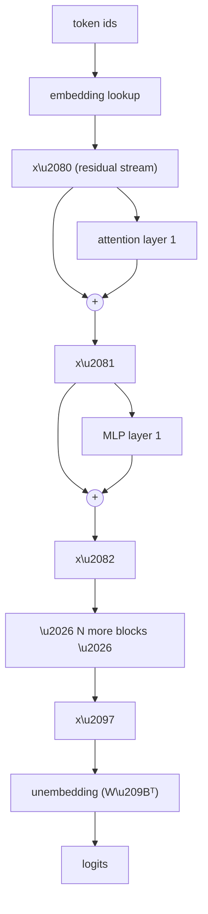

# Post 3 — Embeddings and the Residual Stream

*Part 3 of 12 in **LLM From Scratch**, a series that builds a Gemini/Claude-style decoder in Google Colab, one component at a time.*

In **Post 2** we turned text into a list of integers. Today we turn those integers into **vectors** — and then meet the single most important data structure in a modern LLM: the **residual stream**, the shared scratchpad that every attention layer and MLP reads from and writes to.

Once you understand the residual stream, the entire transformer stops feeling like a tangle of arrows and starts feeling like one *very* long sum.

## How to read this post

- **Skim (2 min):** the diagram in §3.
- **Read (10 min):** all of it.
- **Run (15 min):** open the Colab. The "find the nearest words" cell is fun.

> Colab: **[Open in Colab — `notebook.ipynb`](https://colab.research.google.com/github/lingareddyk-proc/llm-from-scratch-series/blob/main/posts/03-embeddings-residual-stream/notebook.ipynb)** — free CPU, ~5 min.

---

## 1. From integers to vectors

After tokenization, our text is a list of integers like `[464, 3139, 286, 4881, 318]`. The model can't multiply integers — it needs vectors. So step zero of any transformer is a **lookup table**:

```
embedding[token_id] -> vector of length d_model
```

That's it. The embedding layer is just a matrix `W_E ∈ R^{vocab_size × d_model}` whose *rows* are vectors, one per token. "Embedding a sentence" is row-indexing.

Typical sizes:

| Model            | `d_model` | params just in embeddings |
| ---------------- | --------:| -------------------------:|
| GPT-2 small      |  768     | 50,257 × 768 = 38.6M      |
| GPT-3 / 6.7B     | 4,096    | ~205M                     |
| Llama 3 8B       | 4,096    | ~525M                     |
| Llama 3 70B      | 8,192    | ~1.05B                    |

For Llama 3 70B, **a quarter of a billion parameters are just the embedding table**.

## 2. Vectors carry meaning

The embedding for ` king` ends up close (in cosine similarity) to ` queen`, ` prince`, ` monarch`. It ends up far from ` banana`. This is *learned* — the model isn't told what words mean; it discovers that words that play similar roles in similar contexts should be near each other, because that minimizes loss.

In the Colab we'll load GPT-2's trained embeddings and verify exactly this — find the nearest neighbors of ` king`, ` cat`, ` Python`, and so on.

## 3. The residual stream: a transformer's working memory

Here is the entire forward pass of a transformer, in one picture:



The thing called `x` at every step — the bold vertical line in any transformer diagram you've ever seen — is the **residual stream**. It has shape `(seq_len, d_model)`. Every block (attention or MLP) **reads** from it, computes some update vector, and **adds** that update back to it. That's where the name comes from: the stream is the *residual* of the original embedding plus all subsequent additions.

This single idea unlocks a lot:

- **Every layer can talk to every earlier layer**, because their writes are still in the stream.
- **The model can choose to do nothing** at a given block (output ≈ 0 and the stream passes through unchanged). This is why residual networks train so well.
- **Gradients flow cleanly** from output to embeddings — `∂loss/∂x₀` is just the sum of contributions from every block above.

## 4. The math (it really is just `x = x + f(x)`)

Every block does:

```
x = x + attention(layer_norm(x))
x = x + mlp(layer_norm(x))
```

`layer_norm` (or `RMSNorm` in modern models — Post 7) prevents the stream from drifting in scale. `attention` and `mlp` are the only things with learnable parameters.

The whole transformer is just this two-line pattern repeated `N` times (12 for GPT-2 small, 32 for Llama 3 8B, ~80–120 for the biggest open models).

## 5. The unembedding (tied or untied)

At the end of the stack, we have `x_L`, the final residual stream of shape `(seq_len, d_model)`. To produce logits over the vocabulary, we project back up:

```
logits = x_L @ W_U          # W_U has shape (d_model, vocab_size)
```

Many models tie this weight to the embedding — i.e. `W_U = W_E.T`. This halves the embedding-related parameter count and slightly improves performance. GPT-2 ties, Llama 3 does not (it has a separate `lm_head`).

## 6. Why this view matters

Once you see the model as "the residual stream + a bunch of additive updates," the rest of the series gets much easier:

- **Attention (Post 4)** = "read information from other token positions in the stream and add a summary back."
- **Multi-head attention (Post 5)** = "do that read-and-add several times in parallel, looking for different patterns."
- **MLP** = "do a per-token nonlinear transformation and add the result back."
- **RoPE (Post 6)** = "rotate the Q and K vectors *before* the attention read so the read depends on relative position."
- **MoE (Post 10)** = "for each token, pick which sub-MLP gets to write to the stream."

It is all reads from and writes to one shared vector per token.

## 7. How frontier LLMs do this

- **Same exact structure.** Gemini, Claude, GPT-4, Llama 3 all use a residual-stream decoder. The only differences from what we've drawn are: bigger `d_model`, more blocks, normalization swapped for RMSNorm, MLPs swapped for SwiGLU MoE, attention swapped for GQA + RoPE — all upgrades to the *contents* of the additive updates, not to the additive structure itself.
- **The embedding layer is a substantial chunk of the parameters** for smaller models. As you scale, attention + MLP layers grow faster, so embeddings become a smaller fraction (~5% of Llama 3 70B vs ~30% of GPT-2 small).
- **Tied vs untied weights** is a per-model design choice. There's no clear winner; tied is more parameter-efficient, untied gives the output projection independent capacity.

## 8. What we'll do next post

Now we know that every token is a vector and that the model just adds updates to those vectors. Time for the most famous update of all.

**Next: Post 4 — Attention from first principles** — the equation `softmax(Q Kᵀ / √d) V` from a blank slate, with interactive heatmaps you can poke.

---

*Code: [github.com/lingareddyk-proc/llm-from-scratch-series](https://github.com/lingareddyk-proc/llm-from-scratch-series), tagged `v0.3.0`.*
