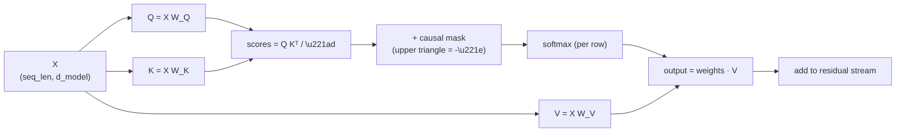

# Post 4 — Attention From First Principles

*Part 4 of 12 in **LLM From Scratch**, a series that builds a Gemini/Claude-style decoder in Google Colab, one component at a time.*

This is the post the series exists for. Today we build **attention** — the one mechanism that makes a transformer a transformer — from a blank slate. By the end you will have written `softmax(Q Kᵀ / √d) V` in NumPy, then in PyTorch, then visualized exactly what it does on the sentence *"The cat sat on the mat because it was tired."*

If you only run one Colab in this series, run this one.

## How to read this post

- **Skim (3 min):** §2 (the analogy) and §4 (the heatmap).
- **Read (15 min):** all of it.
- **Run (30 min):** open the Colab. Drag the temperature slider. Toggle the causal mask. Inspect what the model attends to for the word "it."

> Colab: **[Open in Colab — `notebook.ipynb`](https://colab.research.google.com/github/lingareddyk-proc/llm-from-scratch-series/blob/main/posts/04-attention-from-first-principles/notebook.ipynb)** — free CPU, ~15 min.

---

## 1. What problem does attention solve?

Look at this sentence:

> "The cat sat on the mat because **it** was tired."

What does "it" refer to? You — and a good language model — instantly think *"the cat."* Not "the mat." Not "because." The model needs a mechanism that lets the token at position "it" *look back* at earlier tokens and **pull in information** from the relevant ones.

That is attention.

Concretely: while computing the representation for "it," we want to compute a **weighted average** of the residual-stream vectors at earlier positions, where the weights are high for relevant tokens and low for irrelevant ones.

> Attention = a *learned*, *content-dependent* weighted average.

## 2. Queries, keys, values — the dictionary analogy

Think of a Python `dict`:

```python
d = {"cat": vec1, "mat": vec2, "tired": vec3}
result = d["cat"]   # exact-match lookup
```

A dict requires exact key matches. Attention is the **soft, differentiable** version of this:

- Every token emits a **query** ("I'm looking for something like…").
- Every token also emits a **key** ("here's what I have on offer.").
- The query is compared against *every* key — the result is a **similarity score**.
- Softmax over scores → a probability distribution → a **weighted average** of values.

```
attention(Q, K, V) = softmax( Q Kᵀ / √d ) · V
```

- `Q Kᵀ` — dot products = unnormalized similarity.
- `/ √d` — scaling, so dot products of long vectors don't blow up the softmax (more in §5).
- `softmax(...)` — turns scores into weights that sum to 1.
- `· V` — weighted average.

The three matrices `W_Q`, `W_K`, `W_V` are learned. They project the residual stream into query / key / value spaces:

```
Q = X W_Q        K = X W_K        V = X W_V
```

`X` has shape `(seq_len, d_model)`. Q, K, V each have shape `(seq_len, d_head)`. The output of attention is `(seq_len, d_head)` and gets projected back to `d_model` and **added to the residual stream**.

## 3. The causal mask: why the model can't cheat

We are training the model on a task: given the prefix `tokens[:t]`, predict `tokens[t]`. If at position `t` the model is allowed to attend to position `t+1`, the task is trivial — it just reads the answer. So we **mask** all positions `j > i` to `-inf` *before* the softmax, which makes their attention weight zero. Visually, the attention matrix is **lower-triangular**.

This is the *only* difference between a "decoder" and an "encoder." Encoders (like BERT) don't mask — they see the whole sentence at once and predict masked-out positions. Decoders mask — they predict the next token. Every chatbot LLM is a decoder.

## 4. The diagram



That's it. That's the equation that powers GPT-4, Claude, Gemini, and every other modern LLM. Everything else is engineering on top.

## 5. Why divide by √d?

The dot product of two random vectors of length `d` has variance proportional to `d`. So `Q Kᵀ` has entries with standard deviation ~√d. Feed those into softmax and you get a near-one-hot distribution: gradients vanish, training stalls. Dividing by √d keeps the scale unit-variance regardless of `d_head`. This is the **scaling** in "scaled dot-product attention."

## 6. What you'll do in the Colab

1. Implement scaled dot-product attention in **NumPy**, ~10 lines.
2. Re-implement it in **PyTorch** with `nn.Linear` for `W_Q`, `W_K`, `W_V`.
3. Encode a real sentence with GPT-2, project it into Q/K/V with random weights, and **visualize the attention heatmap**.
4. Apply the **causal mask** and watch the upper triangle go black.
5. Use a *trained* model: pull a single attention head from GPT-2 and inspect what it actually attends to for the word ` it` in our cat-mat-tired sentence. (Expect: high weight on ` cat`.)
6. Play with `temperature` and `d_head` to see how attention sharpness changes.

## 7. The mental model that will carry the rest of the series

Once attention clicks, you can read any future post as a variation on one theme:

- **Multi-head attention (Post 5):** "do attention `n_heads` times in parallel, each with its own `W_Q/K/V`, then concatenate the outputs."
- **Grouped-Query Attention (Post 7):** "share K and V across groups of heads to shrink the KV-cache."
- **RoPE (Post 6):** "rotate Q and K *before* the dot product so the result depends on **relative** position."
- **FlashAttention:** "compute the *same* equation, but tile it so it fits in GPU SRAM and is much faster."
- **MoE (Post 10):** doesn't touch attention at all — it's a swap on the MLP side.
- **KV-cache (Post 9):** "during generation, cache K and V so we don't recompute them every step."

It's all `softmax(Q Kᵀ / √d) V` plus engineering.

## 8. How frontier LLMs do this

- The equation is **identical** in Gemini, Claude, GPT-4, Llama 3, Mistral, etc. There are no exotic alternatives in production at frontier scale.
- The **engineering** around it varies: GQA (Llama 3, Mistral, Gemma), Multi-Query Attention (older PaLM), FlashAttention 2/3 for kernel speed, Sliding-Window Attention (Mistral) for long context, Differential Attention (DeepSeek), Latent Attention / MLA (DeepSeek V2). All of these change *how cheap* attention is to compute, not *what it computes*.
- **Position information** is no longer added to embeddings (the way Vaswani et al. 2017 did it). Modern models inject position into attention itself via **RoPE** — Post 6.

## 9. What we'll do next post

We did attention with one head. Real models do it with 12, or 32, or 96 — in parallel, each looking for a different pattern. We'll visualize what those heads actually specialize in.

**Next: Post 5 — Multi-head attention and why heads specialize.**

---

*Code: [github.com/lingareddyk-proc/llm-from-scratch-series](https://github.com/lingareddyk-proc/llm-from-scratch-series), tagged `v0.4.0`.*
