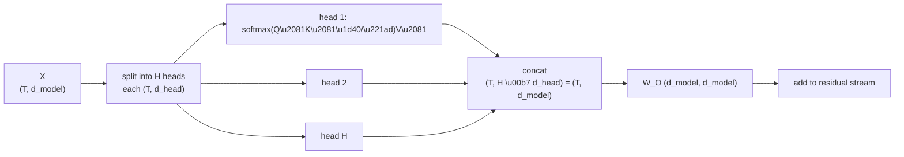

# Post 5 — Multi-Head Attention and Why Heads Specialize

*Part 5 of 12 in **LLM From Scratch**, a series that builds a Gemini/Claude-style decoder in Google Colab, one component at a time.*

**Post 4** built one attention head. Real transformers run many in parallel — 12 heads in GPT-2 small, 32 in Llama 3 8B, 96 in GPT-3 175B. This post explains *why*, implements multi-head attention from scratch, and then visualizes what the heads in pretrained GPT-2 have actually learned to do. You'll meet **previous-token heads**, **induction heads**, **positional heads**, and **subject-resolution heads** — and see them at work on real sentences.

## How to read this post

- **Skim (3 min):** §2 (the analogy) and the head-zoo gallery in the Colab.
- **Read (12 min):** all of it.
- **Run (25 min):** open the Colab and click through every head.

> Colab: **[Open in Colab](https://colab.research.google.com/github/lingareddyk-proc/llm-from-scratch-series/blob/main/posts/05-multi-head-attention/notebook.ipynb)** — free CPU, ~10 min.

---

## 1. Why more than one head?

A single attention head computes **one** weighted average per position. That's one type of "look back and pull in information." But sentences need many *kinds* of relationships looked up at once:

- Subject ↔ pronoun (`cat ↔ it`)
- Verb ↔ object
- Local syntactic structure (the previous token)
- Long-range copying (induction patterns: "X Y … X → Y")
- Positional / order info

A single head can only mix these together — it has one set of `W_Q/K/V` and produces one attention distribution. So we run **multiple heads in parallel**, each with its own small `W_Q/K/V`. Each head learns its own "type" of lookup. Their outputs are concatenated and projected back to `d_model`.

## 2. Multi-head attention: same equation, just `n_heads` times

If we have `d_model = 768` and `n_heads = 12`, we split into `d_head = 768 / 12 = 64`. Each head has its own `(W_Q, W_K, W_V)` of shape `(d_model, d_head)`. So the parameter count is **the same** as a single-head attention with `d_head = d_model` — we just *factor* the projection.

```
for head h in 1..H:
    Q_h = X · W_Q^h      # (T, d_head)
    K_h = X · W_K^h
    V_h = X · W_V^h
    out_h = attention(Q_h, K_h, V_h)   # (T, d_head)

out = concat(out_1, ..., out_H)        # (T, H * d_head) = (T, d_model)
out = out · W_O                        # (T, d_model)  -> add to residual stream
```

In practice we batch all heads into one big tensor `(B, H, T, d_head)` and do everything in parallel — see the Colab.

## 3. Heads specialize. Really.

Once trained, the heads don't all do the same thing. Mechanistic interpretability has named several recurring "head types":

- **Previous-token head:** attends from every position to the position immediately before it. Useful for short-range structure.
- **Positional head:** attends to fixed offsets (e.g. always 2 positions back).
- **Induction head:** the famous one. If the prefix contains a pattern `[A, B, ..., A, ?]`, this head attends from `?` to the token *after* the earlier `A` — i.e. it copies `B`. This is the substrate of in-context learning. (Olsson et al., *Anthropic*, 2022.)
- **Subject / coreference head:** the one we found in Post 4 — `it → cat`.
- **Named-entity heads, code-bracket heads, list-item heads, …** — many task-specific patterns emerge with scale.

The Colab visualizes the attention patterns of all 144 heads in GPT-2 (12 layers × 12 heads) on a couple of sentences and lets you spot examples of each type.

## 4. The diagram



## 5. KV-cache foreshadowing: why Q is "different" from K and V

For a single token's *generation* step, we compute a fresh `Q` for the new position, but `K` and `V` for *all earlier positions* can be cached and reused. This is why papers and code talk about "the KV-cache" and not the "QKV-cache." We'll exploit this in **Post 9** for fast inference.

This is also the motivation for **Grouped-Query Attention** in modern models: K and V are *shared* across groups of heads to make the cache smaller. Post 7 implements GQA.

## 6. How frontier LLMs do this

| Model        | `d_model` | `n_heads`Q | `n_heads`KV | Attention variant         |
| ------------ | --------: | ---------: | ----------: | ------------------------- |
| GPT-2 small  |       768 |         12 |          12 | Multi-Head Attention (MHA)|
| GPT-3 175B   |     12288 |         96 |          96 | MHA                       |
| Llama 3 8B   |      4096 |         32 |           8 | Grouped-Query (GQA, ratio 4) |
| Llama 3 70B  |      8192 |         64 |           8 | GQA (ratio 8)             |
| Mistral 7B   |      4096 |         32 |           8 | GQA + Sliding Window      |
| Gemma 2 9B   |      3584 |         16 |           8 | GQA (ratio 2)             |
| Gemini, Claude | ?       |     many   |        fewer| GQA-family (per public statements) |

The trend is clear: **more Q heads than K/V heads** (GQA), because the KV-cache is the bottleneck during serving — not the math during training.

## 7. What you'll do in the Colab

1. Implement multi-head attention as a single tensor reshape, ~30 lines of PyTorch.
2. Sanity-check that it matches running `n_heads` separate single-head attentions.
3. Load pretrained GPT-2 and dump the attention patterns of **all 144 heads** on the sentence *"When John and Mary went to the store, John gave a drink to Mary."*
4. **Find a previous-token head** (most weight on `j == i - 1`).
5. **Find an induction head**: feed `A B C ... A`, look for heads that copy `B` to the position after the second `A`.
6. **Find a positional head**.
7. Make a "head zoo" grid of mini-heatmaps so you can eyeball all the specializations at once.

## 8. What we'll do next post

We've been computing attention as if position didn't exist — Q and K vectors are projected from the raw embeddings. But "the cat saw the dog" and "the dog saw the cat" have *the same set of tokens* — attention alone can't tell them apart. We need to inject position information. We'll see the original 2017 trick, why it was replaced, and what every modern model uses instead: **RoPE**.

**Next: Post 6 — Positional information: from sinusoids to RoPE.**

---

*Code: [github.com/lingareddyk-proc/llm-from-scratch-series](https://github.com/lingareddyk-proc/llm-from-scratch-series), tagged `v0.5.0`.*
