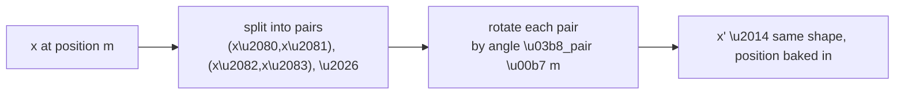

# Post 6 — Positional Information: From Sinusoids to RoPE

*Part 6 of 12 in **LLM From Scratch**, a series that builds a Gemini/Claude-style decoder in Google Colab, one component at a time.*

So far we have built embeddings, the residual stream, and (multi-head) attention. And yet — embarrassingly — our model **cannot tell word order**. *"The cat saw the dog"* and *"The dog saw the cat"* produce the same multiset of token vectors. Attention is permutation-invariant. We need to inject position.

This post walks through the three answers the field has used:

1. **Absolute sinusoidal** (Vaswani et al., 2017) — the original.
2. **Learned absolute positional embeddings** (GPT-2) — simpler, similar effect.
3. **RoPE — Rotary Position Embeddings** (Su et al., 2021) — what Llama 3, Mistral, Gemma, and (per public statements) Gemini and Claude actually use today.

By the end you'll have implemented RoPE in ~15 lines, visualized its rotations in 2-D, and verified mathematically that `(Q'·K')` after RoPE depends only on **relative position**, not absolute.

## How to read this post

- **Skim (3 min):** the rotation diagram in §5.
- **Read (15 min):** all of it.
- **Run (20 min):** open the Colab. The rotation animation makes this click.

> Colab: **[Open in Colab](https://colab.research.google.com/github/lingareddyk-proc/llm-from-scratch-series/blob/main/posts/06-positional-rope/notebook.ipynb)** — free CPU, ~5 min.

---

## 1. Why attention can't tell order

Recall `attention(Q, K, V) = softmax(QKᵀ/√d) V`. If we permute the rows of `X` (the input), then `Q`, `K`, and `V` are permuted the same way, and the output is permuted the same way. **The set of relationships is identical.**

So if the input vectors carry no positional information, the model literally cannot tell *"X happened before Y"* from *"Y happened before X."*

## 2. Solution 1: absolute sinusoidal embeddings (2017)

Vaswani et al. proposed: for each position `pos` and each dimension `i`, define

$$
PE(pos, 2i)   = \sin(pos / 10000^{2i/d})\\
PE(pos, 2i+1) = \cos(pos / 10000^{2i/d})
$$

Then `X_with_pos = X + PE`. The math has a beautiful property: `PE(pos + k)` can be written as a *linear function* of `PE(pos)`, so in principle attention can learn to compare relative positions via linear combinations. But it's an indirect signal.

Pros: no learnable parameters. Extrapolates to lengths beyond training.
Cons: hard for the model to actually use the relative-position structure.

## 3. Solution 2: learned positional embeddings (GPT-2)

GPT-2 just adds a learned vector per position:

```
positional_embeddings = nn.Embedding(max_seq_len, d_model)
x = wte(tokens) + positional_embeddings(positions)
```

Pros: simple. Empirically works as well as sinusoidal.
Cons: hard limit at `max_seq_len`. Cannot extend beyond it.

GPT-2 was trained with `max_seq_len = 1024`. This is one reason GPT-2 isn't a long-context model.

## 4. Solution 3: RoPE — Rotary Position Embeddings

**The idea (one sentence):** instead of *adding* a positional vector to `x`, **rotate** the query and key vectors themselves, in 2-D subspaces, by an angle that depends on position.

After rotation, the dot product `Q'(pos_i) · K'(pos_j)` depends only on the **difference** `pos_j - pos_i`. This is a property called *relative position*: the attention score for "what's 5 positions back" is the same whether we're at position 7 or position 700.

That's the key advantage. With absolute embeddings, position 100 looks fundamentally different from position 1. With RoPE, the model only ever sees *relative offsets*, which generalize naturally.

## 5. The math, in pictures

Split `d_head` into pairs: `(0,1), (2,3), (4,5), …`. Each pair is a 2-D plane. For a vector `(x, y)` in that plane at position `m`, rotate by angle `θ_pair · m`:

$$
\begin{pmatrix} x' \\ y' \end{pmatrix} =
\begin{pmatrix} \cos(\theta_{\text{pair}} \cdot m) & -\sin(\theta_{\text{pair}} \cdot m) \\
                 \sin(\theta_{\text{pair}} \cdot m) &  \cos(\theta_{\text{pair}} \cdot m) \end{pmatrix}
\begin{pmatrix} x \\ y \end{pmatrix}
$$



The per-pair angular frequency `θ_pair` decreases for higher pairs — exactly like sinusoidal embeddings — so low pairs rotate fast (encode short-range) and high pairs rotate slowly (encode long-range).

Apply this rotation to `Q` (at query position `m`) and to `K` (at key position `n`). Then the inner product `Q'(m) · K'(n)` algebraically equals a function of `n - m` only. **Proof and visualization in the Colab.**

## 6. Why RoPE took over

- **Relative-position by construction.** No need for the model to learn it.
- **No extra parameters.** Just a fixed sinusoidal schedule.
- **Plays well with cached K.** In a KV-cache, the K for past positions was rotated once and stored; you only need to rotate the new Q at generation time. (Post 9.)
- **Extrapolates** with simple tricks: NTK-Aware scaling, YaRN, etc. — how Llama 3 stretched to 128k and Gemini 1.5 stretched to 1M+ tokens.

## 7. How frontier LLMs do this

- **Llama (1, 2, 3, 4):** RoPE.
- **Mistral, Mixtral, Gemma 2/3:** RoPE.
- **GPT-NeoX, Falcon, Qwen:** RoPE.
- **DeepSeek:** RoPE (with the Latent Attention twist in V2).
- **Gemini, Claude:** RoPE-family (per public statements; exact details proprietary).
- **GPT-3 / GPT-4:** absolute learned (GPT-3); GPT-4 details not public, widely believed to be some RoPE variant.

If you read any modern open-source LLM codebase, you will find RoPE in the attention block. Implementing it once — which is what the Colab does — buys you fluency with all of them.

## 8. What you'll do in the Colab

1. Implement absolute sinusoidal embeddings and visualize the matrix.
2. Implement learned positional embeddings (one line of PyTorch).
3. Implement RoPE in ~15 lines.
4. **Visualize the 2-D rotation** of a few Q/K pairs across positions.
5. **Numerically verify** that `Q'(m) · K'(n)` depends only on `n - m` (not on `m` and `n` separately).
6. Drop RoPE into our `MultiHeadAttention` from Post 5 and confirm the model still trains as a sanity check.

## 9. What we'll do next post

We now have every ingredient for a real, modern decoder block: residual stream + RMSNorm + multi-head attention with RoPE + grouped-query attention + SwiGLU feed-forward. **Post 7** wires them into the actual block used by Llama 3 and Gemma 2, side-by-side with the original 2017 block so you see exactly what changed.

**Next: Post 7 — The full modern decoder block (Llama / Gemma style).**

---

*Code: [github.com/lingareddyk-proc/llm-from-scratch-series](https://github.com/lingareddyk-proc/llm-from-scratch-series), tagged `v0.6.0`.*
