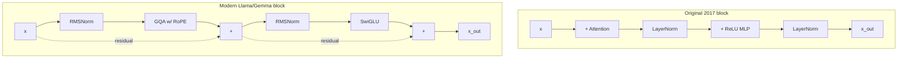

# Post 7 — The Full Modern Decoder Block (Llama / Gemma Style)

*Part 7 of 12 in **LLM From Scratch**, a series that builds a Gemini/Claude-style decoder in Google Colab, one component at a time.*

We've built all the parts. Time to assemble them into the actual transformer block used by Llama 3, Mistral, Gemma, and (per public statements) Gemini and Claude.

This post wires together:

- **RMSNorm** instead of LayerNorm
- **Pre-Norm** residual structure
- **Grouped-Query Attention (GQA)** with **RoPE**
- **SwiGLU** feed-forward

…and shows it side-by-side with the original 2017 block, so you can see exactly what changed and *why*.

## How to read this post

- **Skim (3 min):** the side-by-side diagram in §6.
- **Read (15 min):** all of it.
- **Run (15 min):** open the Colab. It builds the full block, runs a forward pass, prints the shape at every step, and counts parameters.

> Colab: **[Open in Colab](https://colab.research.google.com/github/lingareddyk-proc/llm-from-scratch-series/blob/main/posts/07-modern-decoder-block/notebook.ipynb)** — free CPU, ~5 min.

---

## 1. The change everyone made: Pre-Norm

The 2017 transformer normalized *after* each block:

```
x = LayerNorm(x + attention(x))
x = LayerNorm(x + mlp(x))
```

Modern models normalize *before*:

```
x = x + attention(RMSNorm(x))
x = x + mlp(RMSNorm(x))
```

This makes the residual stream a true "running sum" (the additions are always added straight in, untouched by a normalization), gradients flow more cleanly, and training is more stable at scale. Pre-Norm is universal in modern LLMs.

## 2. RMSNorm: drop the mean

LayerNorm centers (subtract mean) and scales (divide by std). **RMSNorm** skips the centering and just divides by the root-mean-square:

$$
\text{RMSNorm}(x) = \frac{x}{\sqrt{\text{mean}(x^2) + \varepsilon}} \odot \gamma
$$

That's one less reduction per call. Empirically performs as well as LayerNorm and is faster. Llama, Mistral, Gemma, and most modern models use RMSNorm.

## 3. Grouped-Query Attention (GQA)

We met it in Post 5. Recap: have many query heads, but **share** K and V across groups. With `n_heads_q=8` and `n_heads_kv=2`, each pair of Q-heads shares the same K and V. The benefit: the KV-cache (Post 9) is 4× smaller, which is the bottleneck during serving.

Llama 3 8B uses `Hq=32, Hkv=8` (ratio 4×). Llama 3 70B uses `Hq=64, Hkv=8` (ratio 8×). At training time it's a small speedup; at inference time it's the difference between serving 4 users per GPU and 32.

## 4. SwiGLU: a fancier MLP

Original FFN: `Linear → ReLU → Linear`.
Modern FFN: **SwiGLU**:

$$
\text{SwiGLU}(x) = W_{\text{down}} \cdot (\text{SiLU}(W_{\text{gate}} x) \odot (W_{\text{up}} x))
$$

There's a "gate" branch and an "up" branch; they're multiplied element-wise and projected back down. Compared with ReLU-FFN, SwiGLU at the *same* compute consistently gives lower loss. Llama, PaLM, Mistral, Gemma all use it.

> Note: when paper authors say "I trained a model with `d_ff = 2.67 × d_model`," they usually mean SwiGLU with `d_ff` chosen so the parameter count is equivalent to a `4 × d_model` ReLU-FFN (because SwiGLU has 3 matrices, not 2).

## 5. Residual connections, exactly as before

Nothing changes here. The block is still `x = x + f(x)` twice. The whole "modern decoder" is just *that, with f and the normalization upgraded*.

## 6. Side by side



| Component         | 2017 (Vaswani)            | 2025 (Llama 3 / Gemma)            |
| ----------------- | ------------------------- | --------------------------------- |
| Normalization     | LayerNorm, Post-Norm      | RMSNorm, Pre-Norm                 |
| Position info     | Added sinusoidal PE to embeddings | RoPE applied inside attention  |
| Attention         | Multi-Head Attention      | Grouped-Query Attention           |
| Feed-forward      | Linear → ReLU → Linear    | SwiGLU                            |
| Bias terms        | Present                   | Removed in QKV/O/FFN              |

## 7. Putting it in code: `src/model.py`

This post adds a permanent module to the series repo: [`src/model.py`](../../src/model.py). It contains:

- `RMSNorm`
- `build_rope_cache` + `apply_rope`
- `GroupedQueryAttention`
- `SwiGLU`
- `DecoderBlock`
- `TinyLLM` — the full model with embedding + N blocks + tied lm_head

**Posts 8–11 import from this file**, so by the end of the series you can read all ~150 lines and know you understand a real modern LLM.

## 8. What you'll do in the Colab

1. Inspect every class in `src/model.py`.
2. Instantiate the **default config** (~10M parameters) and print the shape at every intermediate step of a forward pass.
3. Visualize the **gradient flow** by comparing `||∂loss/∂x_layer||` across all blocks — Pre-Norm should give smooth gradients across depth.
4. Compare parameter counts between the 2017 block and the modern block at the same `d_model`.

## 9. How frontier LLMs do this

Architecturally we are now at the same level of generality as:

- **Llama 3 / 3.1 / 4** — same block, just bigger (4096 d_model, 32 heads, 8 KV heads, 32 layers).
- **Mistral 7B / Mixtral** — same block + sliding-window attention.
- **Gemma 2/3** — same block + alternating local/global attention.
- **DeepSeek V2/V3** — same block + Multi-head Latent Attention (an additional KV compression).
- **Gemini, Claude** — believed to be same block family + MoE on the FFN side (Post 10).

The leap from us to them is **scale** (4096 → our 256 `d_model`, 32 → our 6 layers), **multimodality**, and **training data + post-training**. Architecturally, you've now seen the whole thing.

## 10. What we'll do next post

We have the architecture. Now we **train it**. Post 8 pretrains our model from scratch on TinyStories — a ~30-min run on free Colab T4 — and shows the loss curve, sample generations at every checkpoint, and the "model learning grammar before narrative" phenomenon.

**Next: Post 8 — Pretraining a small LLM end-to-end on Colab.**

---

*Code: [github.com/lingareddyk-proc/llm-from-scratch-series](https://github.com/lingareddyk-proc/llm-from-scratch-series), tagged `v0.7.0`.*
