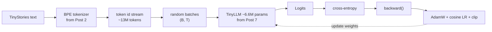

# Post 8 — Pretraining a Small LLM End-to-End on Colab

*Part 8 of 12 in **LLM From Scratch**, a series that builds a Gemini/Claude-style decoder in Google Colab, one component at a time.*

We've built the architecture. We've built the tokenizer. Time to **train**.

This post pretrains our `TinyLLM` from Post 7 from scratch on **TinyStories**, on a free Colab T4 GPU, in about **30 minutes**. By the end you'll watch a randomly-initialized model:

- Output gibberish at step 0.
- Discover whitespace and common words by step 250.
- Form grammatical clauses by step 1000.
- Tell a (very small) coherent story by step 2000.

This is the same recipe — at vastly different scale — that produced GPT-3, Llama 3, Gemini, and Claude.

## How to read this post

- **Skim (3 min):** the loss curve and sample-progression in §6.
- **Read (12 min):** all of it.
- **Run (35 min):** open the Colab on a free T4 GPU. Watch the model learn in real time.

> Colab: **[Open in Colab](https://colab.research.google.com/github/lingareddyk-proc/llm-from-scratch-series/blob/main/posts/08-pretraining-tinystories/notebook.ipynb)** — needs a free Colab T4 GPU, ~30 min.

---

## 1. The training recipe in five lines

```
for step in 1..N:
    batch = sample(corpus, batch_size, seq_len)
    logits = model(batch[:, :-1])
    loss = cross_entropy(logits, batch[:, 1:])
    loss.backward()
    optimizer.step()
```

That is the *entire* pretraining loop of every frontier LLM. Differences vs us are quantitative, not qualitative:

| Knob              | Ours        | GPT-3 175B     | Llama 3 8B           |
| ----------------- | ----------- | -------------- | -------------------- |
| Parameters        | ~6.6M       | 175B           | 8B                   |
| Training tokens   | ~13M        | 300B           | 15T                  |
| Compute           | 1 T4 hr     | ~3,640 PF-days | ~1.3M H100-hours     |
| Wall-clock        | ~30 min     | ~weeks         | ~months              |
| Tokens / param    | ~2          | ~1.7           | ~1,875 (Chinchilla++)|

The "tokens per parameter" ratio is informative. *Chinchilla* showed ~20 is optimal for fixed compute; modern open models like Llama 3 push to 1000+ (overtrain on small models for cheap inference).

We sit at ~2 — we're undertraining on purpose so it finishes in 30 minutes on a T4. The model is small enough that it still produces recognizable English by the end.

## 2. The 5 engineering details that actually matter

These are the dials that decide if a training run succeeds:

1. **Mixed precision (`bfloat16`)** — half the memory, ~2× the throughput. We use `torch.autocast` on CUDA.
2. **Cosine learning-rate schedule with warmup** — linear ramp-up for the first ~100 steps to avoid blowing up, then cosine decay. Universal in modern LLMs.
3. **Gradient clipping** (`max_norm=1.0`) — prevents single bad batches from nuking the model. Universal.
4. **AdamW with `betas=(0.9, 0.95)`** — the second beta is lower than PyTorch's default. Standard for transformer pretraining (Llama, Mistral, GPT-3 all use it).
5. **Weight decay = 0.1** — also standard. Don't decay the embeddings or norms in production runs; for our tiny model, decaying everything is fine.

The `src/train.py` module in this post packages all of these — read it; it's ~120 lines.

## 3. Data: TinyStories

[TinyStories](https://arxiv.org/abs/2305.07759) is ~2M short children's stories written by GPT-3.5 / GPT-4 with vocabulary a 3-year-old understands. Why it's the perfect teaching corpus:

- ~470M tokens — small enough to download in a minute.
- High textual quality (LLM-generated, with curation).
- Simple grammar, small effective vocabulary → a 5-10M parameter model can actually learn it.
- Stories have clear beginning/middle/end → easy to qualitatively assess if the model is learning narrative.

We reuse the 8k-vocab byte-level BPE tokenizer trained in **Post 2** (the notebook also re-trains it if you didn't save it).

## 4. Watching the model learn

The Colab samples a fixed prompt — `"Once upon a time"` — at fixed checkpoints. You'll see something like:

| Step | Sample                                                                                                |
| ---: | :------------------------------------------------------------------------------------------------------ |
| 0    | `Once upon a timetctctctctctctctctct...`                                                              |
| 250  | `Once upon a time the the the to a a the. He went the.`                                               |
| 500  | `Once upon a time there was a little girl. She was at home. Then he saw a big.`                       |
| 1000 | `Once upon a time, a little girl named Lily went to the park. She saw a cat playing with a ball.`     |
| 2000 | `Once upon a time, a little boy named Tim found a shiny red ball. He showed it to his friend Sam.`    |

(Your exact text will vary, but the *quality progression* is the same every run.)

## 5. The loss curve you should see

Training loss should:

1. Spike up briefly during the LR warmup (steps 0–100). Normal.
2. Drop fast from ~9.0 (random) to ~5.0 in the first 250 steps (model learns the unigram distribution).
3. Decay smoothly through ~3.5 → ~3.0 over the remaining ~1750 steps as it learns local syntax.

Validation loss tracks training loss closely — TinyStories is uniform enough that we're nowhere near overfitting with this model size and run length.

If your loss **plateaus high** or **spikes catastrophically**: check `grad_clip` is on, LR isn't too high (≤3e-4 for this size), batch size isn't too small. These are the canonical things to debug.

## 6. The diagram



## 7. What you'll do in the Colab

1. Detect the GPU (T4 in free Colab).
2. Download TinyStories and the tokenizer from Post 2 (or train it inline if you didn't save it).
3. Tokenize ~13M tokens into a flat tensor.
4. Build a `TinyLLM` from `src/model.py`.
5. Run the training loop from `src/train.py` for 2000 steps.
6. Generate from the checkpoint at the end, with several different temperatures.
7. Save the trained weights — **Post 9** uses them to demo the KV-cache, **Post 11** fine-tunes them.

## 8. How frontier LLMs do this

The same loop, scaled and engineered:

- **Distributed training:** Llama 3 was trained on 16k H100 GPUs. The loop is the same — `model.backward()` per rank, plus gradient all-reduce across ranks (`torchrun` or FSDP).
- **Data:** trillions of tokens of carefully filtered web text, code, books, math, and synthetic data. Data quality matters more than data quantity beyond a certain point — see Llama 3 paper.
- **Curriculum:** later in training they often raise context length (e.g. Llama 3: 8k → 128k), reweight data sources, or add code-heavy passes.
- **Compute:** months on tens of thousands of accelerators. **Single biggest line item in a frontier lab's budget.**
- **Eval:** loss alone doesn't tell you if the model is good. Frontier labs evaluate on hundreds of benchmarks (MMLU, HumanEval, GSM8K, BIG-Bench, MT-Bench, etc.) continuously during training.

## 9. What we'll do next post

We have a trained model. Generating from it is slow — every new token does an O(T²) attention recomputation over the whole prefix. **Post 9** fixes this with the **KV-cache**, makes inference ~10× faster, and walks through `top-p` / `min-p` sampling.

**Next: Post 9 — Sampling and the KV-cache.**

---

*Code: [github.com/lingareddyk-proc/llm-from-scratch-series](https://github.com/lingareddyk-proc/llm-from-scratch-series), tagged `v0.8.0`.*
