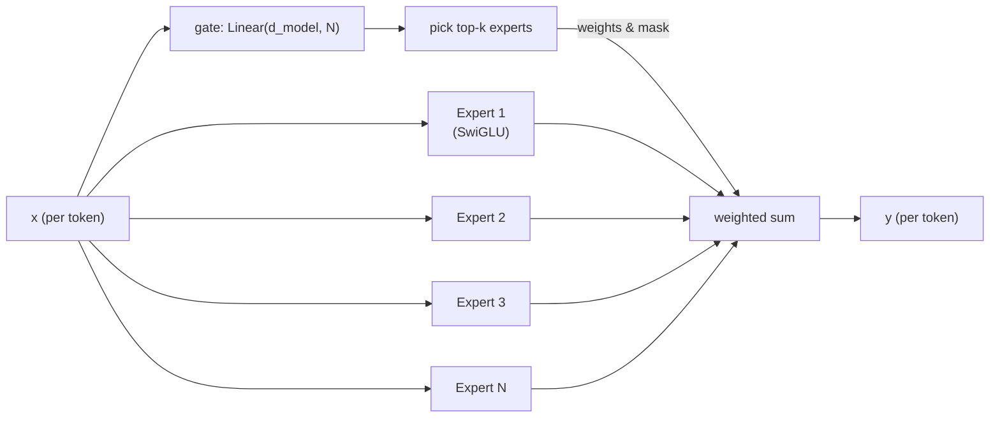

# Post 10 — Mixture of Experts: How Gemini and GPT-4 Scale Further

*Part 10 of 12 in **LLM From Scratch**, a series that builds a Gemini/Claude-style decoder in Google Colab, one component at a time.*

GPT-4. Gemini 1.5/2.x. Mixtral. DeepSeek V2/V3. Grok. The frontier of open and closed LLMs is dominated by one architectural change vs the "dense" Llama-style models we've built so far: **Mixture of Experts (MoE)**.

The pitch is simple: get the *parameter count* of a much bigger model at the *compute cost* of a much smaller one. The mechanism: replace the dense SwiGLU FFN with `N` smaller "expert" FFNs, and for every token, route it to only `k` of them.

This post replaces the SwiGLU in our `TinyLLM` with a small **4-expert top-1 MoE**, trains it briefly, and watches the experts specialize.

## How to read this post

- **Skim (3 min):** §3 (the picture) and the expert-routing heatmap in the Colab.
- **Read (15 min):** all of it.
- **Run (20 min):** open the Colab, watch experts specialize on TinyStories.

> Colab: **[Open in Colab](https://colab.research.google.com/github/lingareddyk-proc/llm-from-scratch-series/blob/main/posts/10-mixture-of-experts/notebook.ipynb)** — free CPU or T4, ~15 min.

---

## 1. Why MoE?

Recall: in a dense decoder, *every* parameter participates in *every* token's forward pass. That's wasteful — different tokens probably want different transformations applied to them. The token ` def` (in code) wants something different from the token ` once` (in a story).

MoE makes this explicit. The FFN becomes a *pool* of `N` experts, plus a small **gate** that decides which `k` experts each token visits. Typical configs:

- **Mixtral 8×7B:** 8 experts, top-2 routing. Total params 47B, **active** params per token ≈ 13B.
- **DeepSeek V3:** 256 experts + 1 shared, top-8. Total 671B, active 37B.
- **Grok 1:** 8 experts, top-2. Total 314B, active 78B.
- **GPT-4 (widely understood):** ~16 experts, top-2.
- **Gemini 1.5/2.x:** confirmed MoE; counts not public.

The "active" count is what determines forward-pass FLOPs and serving cost. The "total" count is what determines memory and (loosely) capability.

## 2. The MoE block, in code-shape

For each token `x` (a `d_model`-vector):

```
gate_logits = Linear(d_model, N)(x)             # (N,)
top_k_indices, top_k_logits = topk(gate_logits, k=top_k)
top_k_probs = softmax(top_k_logits)              # (top_k,)
y = sum(top_k_probs[i] * Expert_i(x) for i in top_k_indices)
```

That's the *entire* mechanism. Each expert is just a regular SwiGLU FFN. The gate is a single `Linear`.

## 3. The diagram



The crucial property: if `top_k = 2` and `N = 8`, then **only 2 out of 8 experts run for each token**. Compute scales with `top_k`, not `N`. Memory scales with `N`.

## 4. Load balancing — the not-so-fun part

Without intervention, the gate quickly learns a degenerate strategy: route everything to one or two "winner" experts, leaving the rest unused. Training stalls.

The standard fix is an **auxiliary load-balancing loss**:

$$
\mathcal{L}_{\text{aux}} = N \sum_{i=1}^{N} f_i \cdot P_i
$$

where `f_i` is the fraction of tokens routed to expert `i` (a *hard* count) and `P_i` is the mean gate probability for expert `i` (a *soft* mean). If routing is uniform, both ≈ `1/N`, and the loss is ≈ 1. If routing is unbalanced, it gets large. We add `α · aux_loss` (typically `α ≈ 0.01`) to the cross-entropy loss.

DeepSeek V3 went further with an "auxiliary-loss-free" routing scheme; we'll stick to the classic version in the Colab.

## 5. Token-choice vs expert-choice

There are two routing flavors:

- **Token-choice** (what we'll implement, what Mixtral does): each token picks its top-k experts.
- **Expert-choice** (Google's GShard/Switch family): each expert picks the top-`capacity` tokens it wants to process. Avoids the load-balancing problem by construction but breaks autoregressivity in some implementations.

## 6. Capacity, dropping, and why MoE inference is painful

If too many tokens want the same expert, you either (a) drop the overflow (lossy), or (b) overflow into another expert (Mixtral's "expert capacity factor"). At inference time, batches of unpredictable shape make load balancing genuinely hard — this is why MoE models tend to use bigger batch sizes and benefit a lot from **expert parallelism** (each expert on its own GPU).

## 7. What you'll do in the Colab

1. Build a `MoESwiGLU` module — gate + 4 expert SwiGLUs + top-1 routing + load-balance loss.
2. Make an `MoETinyLLM` by swapping the SwiGLU in our `DecoderBlock` for `MoESwiGLU`.
3. Train it on TinyStories for ~500 steps.
4. **Visualize the routing decisions**: for a sample sentence, plot which expert each token went to. Look for specialization (e.g. one expert taking spaces / punctuation, another taking names).
5. Compare active params, total params, and rough FLOPs against the dense `TinyLLM`.

## 8. How frontier LLMs do this

- **GPT-4:** widely understood to be ~16-expert top-2 MoE.
- **Gemini 1.5/2.x/3:** confirmed MoE; topology not public.
- **Claude family:** dense vs MoE not officially disclosed; some external analyses lean MoE for the largest tiers.
- **Mixtral, DeepSeek V3, Qwen3-MoE, Grok 1:** all open MoE in the 50B–700B-total range.

The "dense vs MoE" axis is now the biggest open question in frontier architecture. Dense (Anthropic-style?) is simpler to serve and quantize; MoE (Google/Mistral/DeepSeek-style) gives more capability per FLOP.

## 9. What we'll do next post

We have a pretrained base model. It can do next-token prediction — but it can't follow instructions, refuse harmful requests, or hold a conversation. That's a *fine-tuning* problem, not an architecture problem. Post 11 walks through the recipe every chatbot uses: **SFT + DPO**.

**Next: Post 11 — From base model to assistant: SFT and DPO.**

---

*Code: [github.com/lingareddyk-proc/llm-from-scratch-series](https://github.com/lingareddyk-proc/llm-from-scratch-series), tagged `v0.10.0`.*
