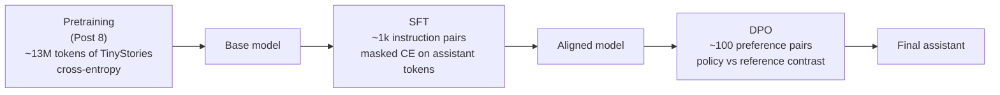

# Post 11 — From Base Model to Assistant: SFT and DPO

*Part 11 of 12 in **LLM From Scratch**, a series that builds a Gemini/Claude-style decoder in Google Colab, one component at a time.*

After Post 8 we had a **base model**: it can complete sentences, but it can't follow instructions. Tell it "Translate to French: hello" and it will reply something like " — That was a fun conversation, anyway, here is another story…" — because it learned to *predict next tokens of TinyStories text*, not to *behave like an assistant*.

Turning a base model into an instruction-following, helpful assistant is **not an architecture change**. It is **post-training**: two more stages on top of the same model.

1. **SFT — Supervised Fine-Tuning** on instruction/response pairs. Teaches the *format* and basic *behavior*.
2. **Preference optimization** — RLHF or its modern, simpler variant **DPO**. Teaches the model *which of two answers humans prefer*. Often called the "alignment" step.

This is the recipe behind ChatGPT, Claude, Gemini — same idea, different scale and data.

## How to read this post

- **Skim (3 min):** §6 (the three-stage diagram).
- **Read (15 min):** all of it.
- **Run (25 min):** open the Colab. SFT and DPO are both quick fine-tunes on free Colab.

> Colab: **[Open in Colab](https://colab.research.google.com/github/lingareddyk-proc/llm-from-scratch-series/blob/main/posts/11-sft-and-dpo/notebook.ipynb)** — free CPU or T4, ~10 min.

---

## 1. Why a base model can't chat

A base model predicts the next token in *whatever text it was trained on*. Our TinyStories model has seen ~13M tokens of children's stories. Given the prompt `"Translate to French: hello"`, the most likely next tokens are story-continuation tokens, not a French word.

To make the model *want* to answer, we have to:

1. Show it many examples of `"<user instruction> → <assistant response>"`, so the *form* of "instruction then answer" becomes natural — that's SFT.
2. Show it preference data — "answer A is better than answer B" — so it learns to lean toward higher-quality responses — that's DPO.

We don't change a single line of `src/model.py`. We just keep training it on different data, with different loss functions.

## 2. SFT in detail

SFT is just **more next-token prediction**, on a **different dataset**. The dataset is a list of `(instruction, response)` pairs formatted with special tokens to mark roles:

```
<|im_start|>user
Translate "hello" to French.<|im_end|>
<|im_start|>assistant
Bonjour.<|im_end|>
```

We tokenize that whole conversation, but **only compute loss on the assistant tokens**. The user's instruction tokens are "given context" — we don't want the model trained to predict user messages.

Implementation: mask the instruction-region of the loss with `-100` (PyTorch's `ignore_index` for `cross_entropy`).

That's it. SFT is "cross-entropy with a clever mask."

## 3. Why SFT isn't enough

After SFT, the model will respond — but the responses might still be:

- Wrong / hallucinated
- Unsafe
- Verbose / unhelpful
- Inconsistent

We need a signal of *which response is better*. That's where preferences come in.

## 4. The "old" recipe: RLHF (PPO)

Original ChatGPT recipe (Christiano et al. 2017, Ouyang et al. 2022):

1. Collect pairs of model responses to the same prompt, have humans pick the better one.
2. Train a **reward model** — a separate transformer that learns to predict human preference scores.
3. Fine-tune the SFT model with **reinforcement learning (PPO)** against the reward model.

It works, but: complicated, finicky, requires 2 extra models in memory (reward model + reference model), unstable.

## 5. The new recipe: DPO

**Direct Preference Optimization** (Rafailov et al., NeurIPS 2023) noticed something remarkable: you can write down the optimal RL solution in closed form, and at the optimum the policy itself is the reward model. So you can skip the explicit reward model and the RL loop, and instead fine-tune the policy directly on preference pairs with a clever loss:

$$
\mathcal{L}_{\text{DPO}}(\pi_\theta) = -\mathbb{E}_{(x, y_w, y_l)}\left[\log \sigma\left(\beta \log \frac{\pi_\theta(y_w \mid x)}{\pi_{\text{ref}}(y_w \mid x)} - \beta \log \frac{\pi_\theta(y_l \mid x)}{\pi_{\text{ref}}(y_l \mid x)}\right)\right]
$$

In plain English: **make the model more likely to produce the chosen answer than the rejected answer, *relative to a frozen reference model***. The reference model (`π_ref`) is just a copy of the SFT model kept frozen — it stops the policy from drifting too far from the SFT distribution.

Operationally, DPO is **gradient descent on a single cross-entropy-like loss**, no RL, no separate reward model. Much simpler than PPO with comparable or better quality.

DPO is now the default preference-optimization recipe at frontier labs and in open source: Llama 3, Mistral, Gemma, Qwen, DeepSeek, Zephyr all ship a DPO-tuned variant. (Variants like KTO, IPO, SimPO are all in the DPO family.)

## 6. The three-stage diagram



Every chatbot LLM on Earth follows this picture. The differences are:

- **Pretraining data:** us TinyStories ~13M tokens; Llama 3 ~15T tokens.
- **SFT data:** us ~1k toy pairs; frontier labs millions of curated pairs.
- **Preference data:** us ~100 hand-crafted; frontier labs millions of human and AI feedback pairs.
- **DPO/RLHF iterations:** us one pass; frontier labs many rounds, mixed with safety / red-teaming / Constitutional AI / RLAIF.

## 7. What you'll do in the Colab

1. Load the TinyLLM checkpoint from Post 8 (or train a fresh one quickly if missing).
2. Add `<|im_start|>` / `<|im_end|>` / `user` / `assistant` special tokens to the tokenizer.
3. Build a ~1000-row toy instruction dataset (deterministic templates so it actually works at our model size).
4. **SFT** the model with masked cross-entropy on assistant tokens.
5. Show same prompt before / after SFT.
6. Run **DPO** on a handful of hand-crafted preference pairs.
7. Show the model's likelihood ratio of chosen vs rejected responses shifting toward chosen.

This is the same conceptual flow as Llama 3 → Llama 3 Instruct, or Mistral → Mistral Instruct.

## 8. How frontier LLMs do this

- **Anthropic / Claude:** Constitutional AI — uses a written set of principles + AI critiques (RLAIF) for the preference step. Same DPO-family math under the hood.
- **OpenAI:** SFT + RLHF (PPO) historically; current models believed to use a DPO-family method plus extensive iterative red-teaming.
- **Google / Gemini:** SFT + RLHF. Some public papers (e.g. Gemma) describe DPO/IPO usage.
- **Meta / Llama 3:** SFT + Rejection Sampling + DPO, in multiple iterations. Each iteration generates new preferences from the latest model.

The common pattern: **(generate → annotate preferences → DPO → repeat)** is now standard. It's a tight loop, not a one-shot.

## 9. What we'll do next post

We have built and trained our own Gemini/Claude analogue. Time to step back and **map** every piece we built onto the public blueprint of a frontier LLM — tokenizer, decoder block, pretraining, MoE, SFT/DPO, KV-cache, inference — plus a reading list for going deeper.

**Next: Post 12 — Putting it together: how a frontier LLM is actually built.**

---

*Code: [github.com/lingareddyk-proc/llm-from-scratch-series](https://github.com/lingareddyk-proc/llm-from-scratch-series), tagged `v0.11.0`.*
