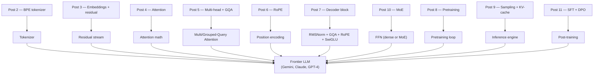

# Post 12 — Putting It Together: How a Frontier LLM Is Actually Built

*Part 12 of 12 in **LLM From Scratch**, a series that builds a Gemini/Claude-style decoder in Google Colab, one component at a time.*

We did it. Over 11 posts we built every major piece of a modern LLM — tokenizer, embeddings, attention, RoPE, GQA, RMSNorm, SwiGLU, full decoder block, pretraining, KV-cache inference, MoE, SFT, DPO.

This final post does three things:

1. **Maps** every component we built onto the public blueprint of a frontier LLM (Gemini 3, Claude 4, GPT-4o, Llama 3/4).
2. **Names** what we deliberately *didn't* cover and what the path forward looks like.
3. **Ships** one combined Colab notebook that stitches the best version of every component into a single end-to-end runnable model — a true mini-frontier LLM in ~500 lines of code.

## How to read this post

- **Skim (3 min):** the master comparison table in §3.
- **Read (15 min):** all of it.
- **Run (20 min):** open the Colab. The "mini-frontier LLM" notebook puts everything end-to-end.

> Colab: **[Open in Colab](https://colab.research.google.com/github/lingareddyk-proc/llm-from-scratch-series/blob/main/posts/12-frontier-llm-mapping/notebook.ipynb)** — free CPU or T4, ~15 min.

---

## 1. The full architecture, in one paragraph

**You take a sequence of bytes (Post 2)**, run them through a learned byte-level **BPE tokenizer (Post 2)** to get integer IDs. You **look up each ID in an embedding table (Post 3)** to get vectors that live in a shared **residual stream (Post 3)**. You pass that stream through **N decoder blocks**, each of which: applies **RMSNorm (Post 7)**, then **Grouped-Query Attention (Post 5)** with **RoPE (Post 6)** baked into Q and K, adds the result to the stream, applies RMSNorm again, then either a **SwiGLU FFN (Post 7)** or a **Mixture-of-Experts block (Post 10)**, and adds that to the stream. After all blocks, you apply a final RMSNorm and project to a vocabulary-sized logit vector via a (possibly tied) `lm_head (Post 3)`. You sample one token (Post 1), append, repeat — accelerated by a **KV-cache (Post 9)**. Training is **autoregressive cross-entropy** on trillions of tokens with **AdamW + cosine LR + bfloat16 + gradient clipping (Post 8)**. Post-training is **SFT** then **DPO/RLHF (Post 11)** to make it follow instructions.

That paragraph is the entire frontier LLM. Every word maps to a post you've already worked through.

## 2. Architecture map: each post → frontier model component

## 3. Master comparison table

| Component                  | Ours (this series)                     | Llama 3 8B            | Llama 3 70B            | Mixtral 8×7B (MoE)         | Frontier (Gemini 3 / Claude 4 / GPT-4o) |
| -------------------------- | -------------------------------------- | --------------------- | ---------------------- | -------------------------- | --------------------------------------- |
| Tokenizer                  | 8k BPE (TinyStories)                   | 128k BPE              | 128k BPE               | 32k BPE                    | 100k–256k BPE (proprietary)             |
| `d_model`                  | 256                                    | 4,096                 | 8,192                  | 4,096                      | ~10k+ (estimated)                       |
| Layers                     | 6                                      | 32                    | 80                     | 32                         | ~80–120 (estimated)                     |
| Q heads                    | 8                                      | 32                    | 64                     | 32                         | many                                    |
| KV heads (GQA)             | 2                                      | 8                     | 8                      | 8                          | few (GQA-family)                        |
| Position                   | RoPE                                   | RoPE                  | RoPE                   | RoPE                       | RoPE-family                             |
| Norm                       | RMSNorm Pre-Norm                       | RMSNorm Pre-Norm      | RMSNorm Pre-Norm       | RMSNorm Pre-Norm           | RMSNorm Pre-Norm                        |
| FFN                        | SwiGLU                                 | SwiGLU                | SwiGLU                 | **SwiGLU MoE (8/top-2)**   | SwiGLU MoE (Gemini), unknown (Claude)   |
| Total params               | ~6.6M                                  | 8B                    | 70B                    | 47B                        | hundreds of B–T (estimated)             |
| Active params              | =total                                 | =total                | =total                 | ~13B                       | tens to ~hundreds of B                  |
| Context length             | 256                                    | 8k (→128k with YaRN)  | 8k (→128k with YaRN)   | 32k                        | 200k (Claude), 1M+ (Gemini)             |
| Training tokens            | ~13M                                   | 15T                   | 15T                    | ~6T                        | tens of trillions                       |
| Training compute           | ~30 min, 1 T4                          | ~1.3M H100-hrs        | ~6.4M H100-hrs         | ~13M H100-hrs (estimated)  | tens of millions of H100-hrs            |
| Post-training              | toy SFT + toy DPO                      | SFT + iterative DPO   | SFT + iterative DPO    | SFT + DPO                  | SFT + RLHF/DPO/Constitutional AI + safety + RM ensembles |
| Inference                  | naïve + KV-cache (Post 9)              | vLLM / TGI            | vLLM / TGI             | vLLM (expert parallel)     | proprietary serving (Paged + spec. dec.) |

The right two columns differ from us by *scale*, *engineering*, and *post-training rigor* — not by **architectural idea**.

## 4. What we deliberately did NOT cover

If you want to keep going, here's the map of "missing pieces" and where to start:

| Topic                           | Why we skipped                  | Where to learn                                                  |
| ------------------------------- | ------------------------------- | --------------------------------------------------------------- |
| **Multimodality** (vision/audio)| Whole separate series           | Llama 3.2 paper, Gemini 1.5 tech report, CLIP / SigLIP papers   |
| **Long context (1M+)**          | YaRN/NTK math, ring attention   | YaRN paper, ring attention paper, Gemini 1.5 report             |
| **FlashAttention 2/3**          | Kernel-level optimization       | Tri Dao's papers + the `flash-attn` repo                        |
| **PagedAttention** (vLLM)       | Serving infrastructure          | vLLM paper, vLLM GitHub                                         |
| **Speculative decoding**        | Inference engineering           | Leviathan et al. 2023, EAGLE-2 / Medusa                         |
| **Distillation & quantization** | Compression techniques          | DistilBERT, AWQ, GPTQ, EXL2 papers                              |
| **Tool use & agents**           | Application layer               | ReAct, Toolformer, OpenAI tools API docs                        |
| **Constitutional AI / RLAIF**   | Specialized alignment           | Anthropic's CAI paper, Llama 3 alignment section                |
| **Evaluation suites**           | Worth its own series            | MMLU, HumanEval, GSM8K, MT-Bench, Arena-Hard, lm-eval-harness   |
| **MLA (Latent Attention)**      | DeepSeek-V2/V3-specific         | DeepSeek-V2 / V3 papers                                         |
| **Sliding window attention**    | Mistral / Gemma-specific        | Mistral 7B paper, Gemma 2 paper                                 |

## 5. Reading list for going deeper

Foundational:
- *Attention Is All You Need* (Vaswani et al., 2017) — start here, even though our modern block diverges.
- *Mathematical Framework for Transformer Circuits* (Elhage et al., Anthropic 2021) — the residual-stream view of transformers; pairs perfectly with our Post 3.
- *In-context Learning and Induction Heads* (Olsson et al., Anthropic 2022) — the formal version of what we found in Post 5.

Architecture:
- *Llama 3 Technical Report* — the most detailed public account of a frontier-scale training run.
- *Gemini 1.5 Technical Report* — long context + MoE in production.
- *DeepSeek V3 Technical Report* — current open MoE state of the art.
- *Gemma 2 Technical Report* — modern dense decoder, clean writeup.

Training & alignment:
- *Direct Preference Optimization* (Rafailov et al., 2023) — the math we implemented in Post 11.
- *Constitutional AI* (Anthropic 2022) — how Claude is aligned without per-output human labels.
- *Training Compute-Optimal Large Language Models* (Hoffmann et al., 2022) — the "Chinchilla" scaling laws.

Inference:
- *FlashAttention 2 / 3* papers — Tri Dao et al.
- *vLLM: Efficient Memory Management for Large Language Model Serving with PagedAttention* (Kwon et al., 2023).

## 6. What you'll do in the Colab

One **combined notebook** that:

1. Imports `src/model.py` and `src/train.py` from the repo.
2. Builds the full modern `TinyLLM`.
3. Trains briefly (or loads a Post 8 checkpoint).
4. Generates with the KV-cache from Post 9.
5. Renders the **architecture summary** as a table — model topology vs Llama 3 8B.

This is the "snapshot" notebook to keep open while reading the series.

## 7. Where to go from here

Three concrete paths:

1. **Scale up.** Try `d_model=512, n_layers=12` and pretrain for longer on a paid Colab T4 / A100. With ~50M params and an hour you can produce noticeably better stories.
2. **Read one real codebase.** [Karpathy's nanoGPT](https://github.com/karpathy/nanoGPT) and [Llama 3 reference](https://github.com/meta-llama/llama-models) are both ~few-hundred lines for the model. You'll recognize every component now.
3. **Pick a frontier topic.** Implement RoPE long-context extension (YaRN), or write a tiny FlashAttention kernel in Triton, or try sliding-window attention.

## 8. Thank you

This series exists because the frontier of AI is, surprisingly, *not* hidden behind impenetrable math. It's ~500 lines of PyTorch + an enormous amount of compute and curated data. By writing those 500 lines, you've earned the right to read any modern LLM paper and follow it.

If this series helped you, the best way to pay it forward is to teach someone else.

— *Linga Reddy K*

---

*Code: [github.com/lingareddyk-proc/llm-from-scratch-series](https://github.com/lingareddyk-proc/llm-from-scratch-series), tagged `v1.0.0`.*
